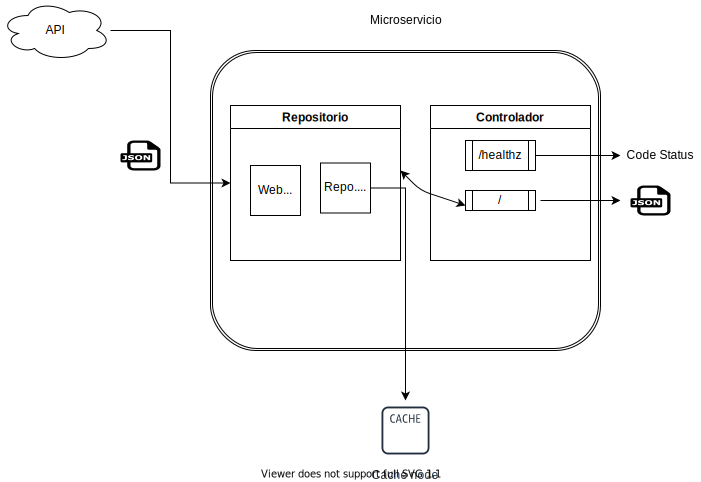

Propuesta de solución para Hackathon Ceiba 2021

Descripción de la solución
La estrategia que vamos a utilizar consiste en aplicar programacion Reactiva mediante 
Spring Web Flux, esto debido a que nos puede brindar una mayor eficiencia a la hora de atender
varias solicitudes http. Tambien, decidimos utilizar una Cache, para solucionar los problemas de latencia de la API 
y asi poder asegurar una respuesta del servicio. 

Drivers que orientan la toma de decisiones para la solución propuesta
Tolerancia de fallos, Mantenibilidad, Escalabilidad

Diagrama de solución

